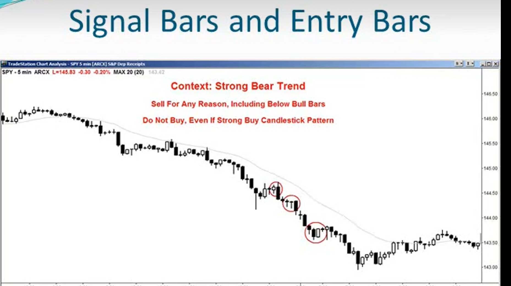
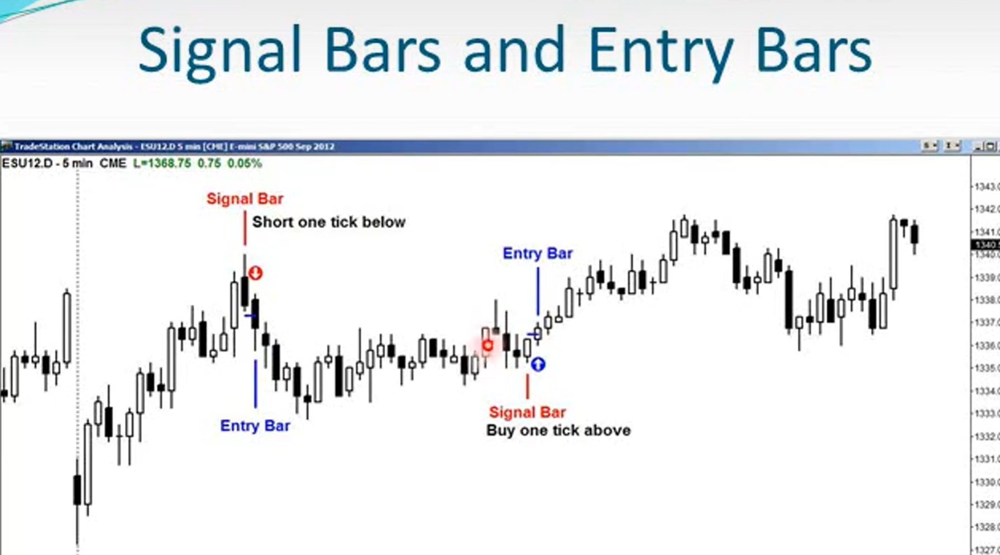
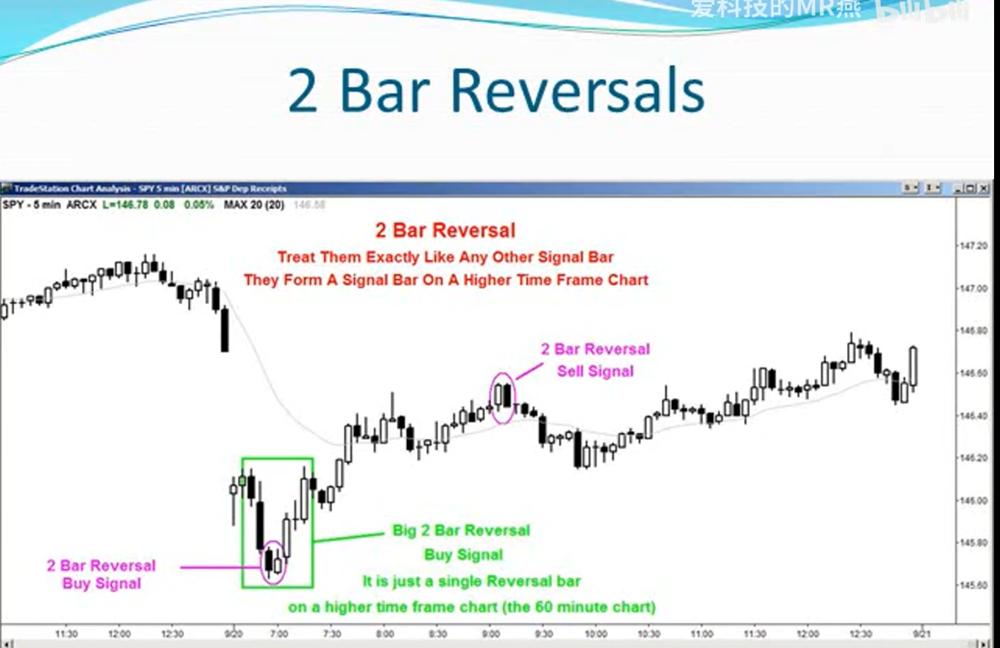
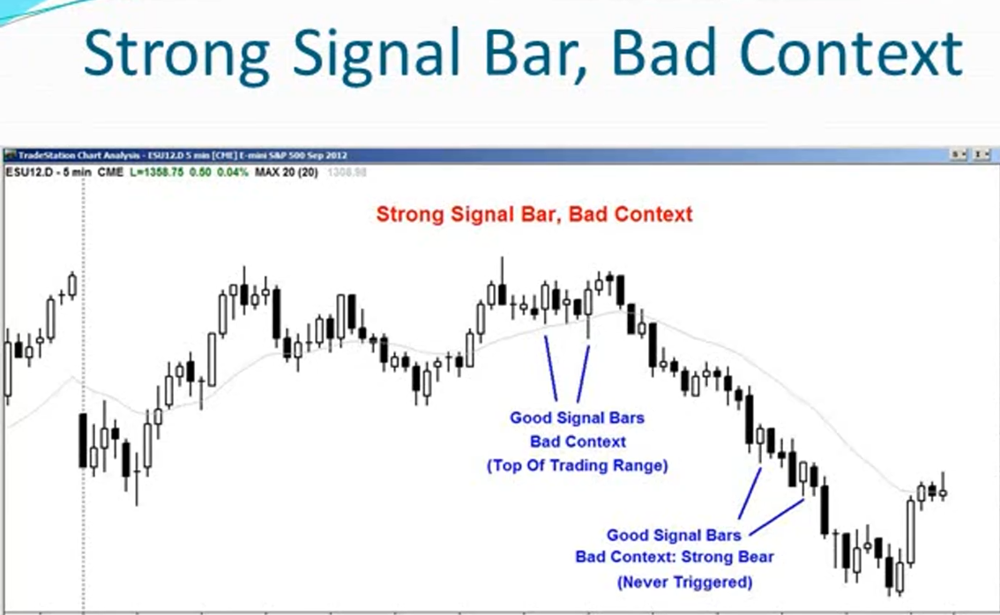
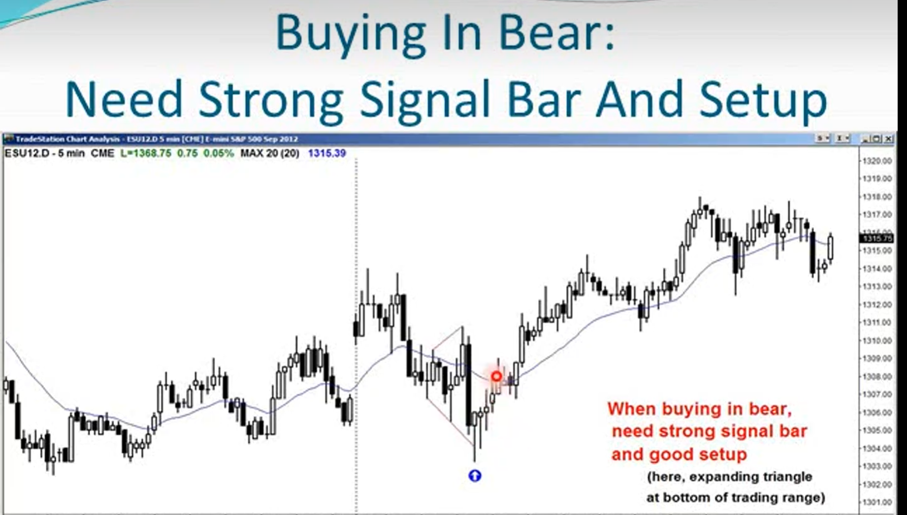
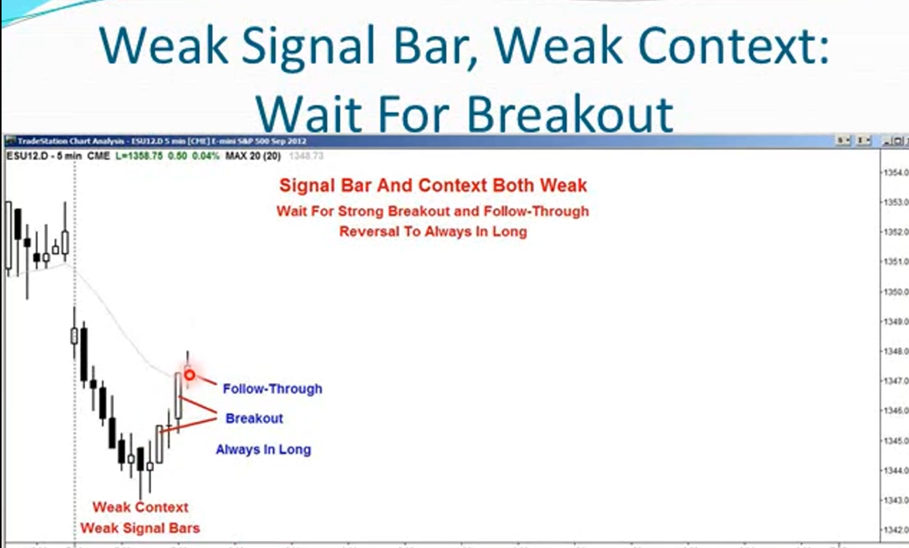
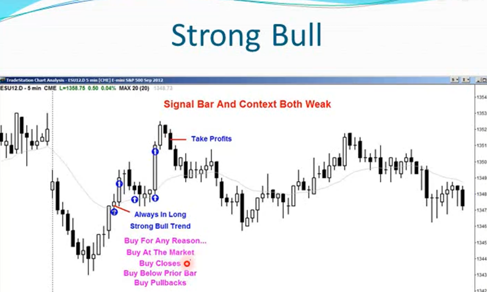
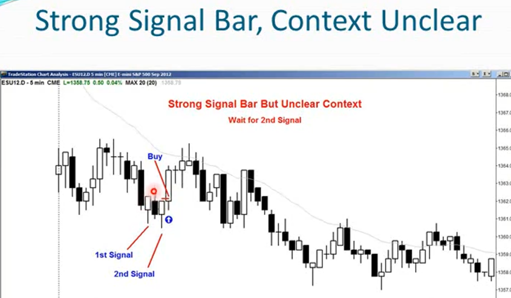
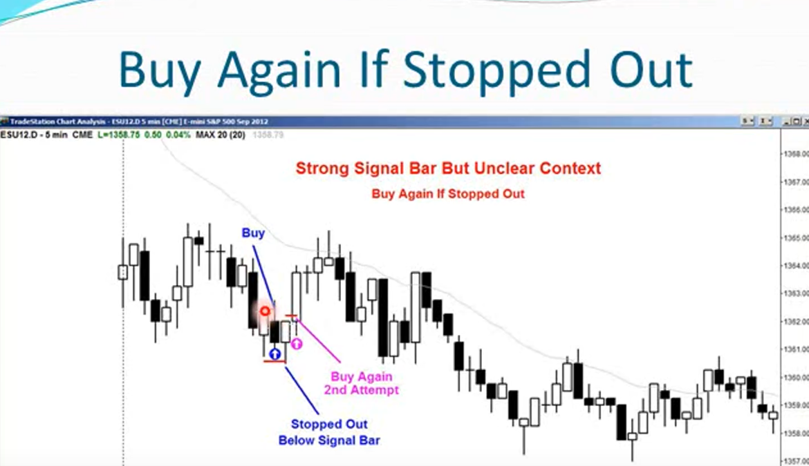

1. 机构、市场主力并不关心K线形态

2. 机构更关心市场背景，处于市场周期的哪个阶段，趋势的强度（抛售和买入压力）

3. 当市场处于强劲的多头趋势中，即使你看到一根非常棒强劲的看跌反转K线，也无关紧要，不应该做空，而且只做多。应该想到的是这是个赚钱的机会。等待2-3根K线，判断空头会在哪里止损离场，在他们离场的位置做多

4. 市场背景远比实际信号重要的多
5. 空头的止损位就是多头确定性较高的进场位

6. 如何判断多头反转信号K？
    - 至少满足以下条件之一：
        - 收盘价高于其中点
        - 收盘价高于开盘价（光脚阳线）
        - 底部有下影线，且下影线长度至少为柱体的一半
    - 最佳多头反转K线：
        - 开盘价低于或接近前一根K线的最低价
        - 收盘价远高于前一根K线的收盘价
        - 下影线约为整根K线高度的三分之一到二分之一
        - K线顶部上影线很小或没有
        - 和前一根重叠部分不多
        - 信号K线之后的K线不是十字星或内包线，而是一根很强的入场K线
        - 收盘价逆转前1-3根K线的收盘价和最高价

7. 双K线反转信号线
    - 每一根信号K的本质都是一种反转
    - 当反转形态跨越两根K线时，构成一个双K反转形态
    - 构成形态的两根K线不必相邻
    - 在更高级别的时间框架图中，它们会合并形成一根单一的信号K线

8. 在交易区间内，一根强劲的信号K线不足以成为交易的理由，背景条件必须合适，即在这个特定期待时刻突破时合乎情理的，是有理由的突破：
    - 你想在这个交易区间进行超短交易BLSHS
    - 不想在区间底部附近卖出，在顶部范围买入
    - 大多数突破尝试都会失败
    
9. 在强趋势行情中，背景条件：
    - 不要试图寻找反转点，因为大多数尝试都会失败​
    - 只进行顺势交易

10. 在弱趋势行情中，背景条件：
    - 在绝大多数情况下，顺势交易
    - 如果趋势是一个波动很大的通道，当遇到好的信号K时，可以双向交易

11. 如果想要在弱牛行情中做空或想要在通道中做空，需要必须同时有
    - 卖方压力的证据
    - 且要能够看到一根强劲的卖出信号K

12. 只要交易信号不佳，那么就需要一根强劲的交易信号柱

13. 强劲的交易机会并不需要强劲的信号k。在强趋势中，趋势方向的信号k往往是比较弱的，此时往往是一个非常好的买入机会，但信号k却很差，这没关系只要趋势够强势。

14. 当你遇到非常强劲的趋势并试图买入时，不要担心信号K是否完美，等待完美的信号K将错过所有的趋势。甚至可以在移动平均线下方首次收盘价之上买入

15. 所有扩张三角形都和主要趋势反转一样强劲

16. 当遇到一个交易信号模糊和信号柱较弱时，最好等待。该等什么？
    - 强劲的突破
    - 明确的市场趋势
    - 放弃首次信号，等待几根K线后的二次信号入场

17. 强劲的多头突破并持续上行，即一根阳线后又是一根阳线
    - 市场的始终持仓状态由空头趋势反转为多头趋势
    - 现在市场处于强劲的多头趋势中
    - 可以处于任何原因的买入，包括市价买入

18. 在交易信号模糊时，理应等待，如果必须选择入场时
    - 正常交易
        - 设置窄止损，如果止损出局，在出现第二个信号时再次正常入场。如果第二个信号再次出局，不要理会第三个信号，因为你可能在对抗一个比想象中更强的趋势
    - 轻仓交易
        - 设置非常宽的止损
        - 正常止损，如果止损出局。在市场给出第二个交易信号时仓位加倍

19. 当市场朝着有利于你的方向发展时，可以设置更加紧凑的止损位，实际风险小于最初的风险。如果实际风险较小，那么可以较小的盈利目标（于基于初始风险设置目标而言，实现该目标概率更高，因为目标没那么遥远）
