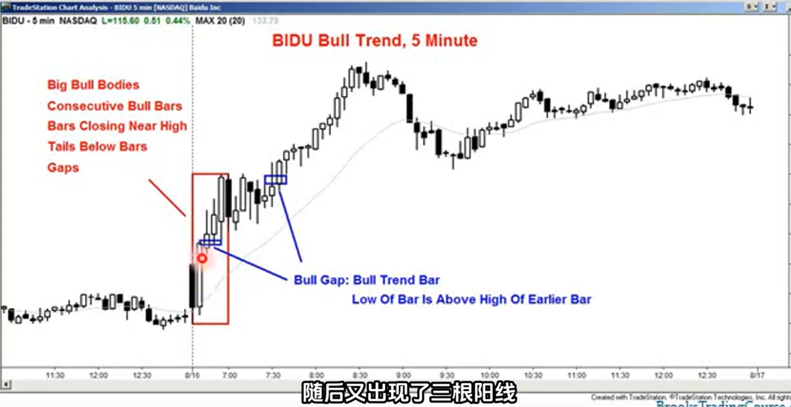
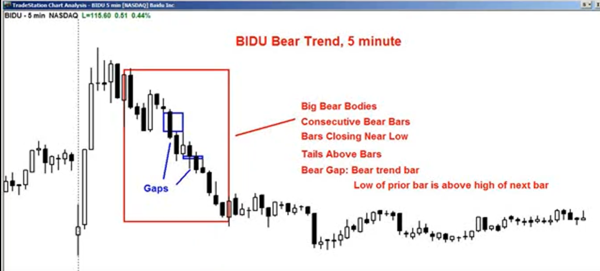
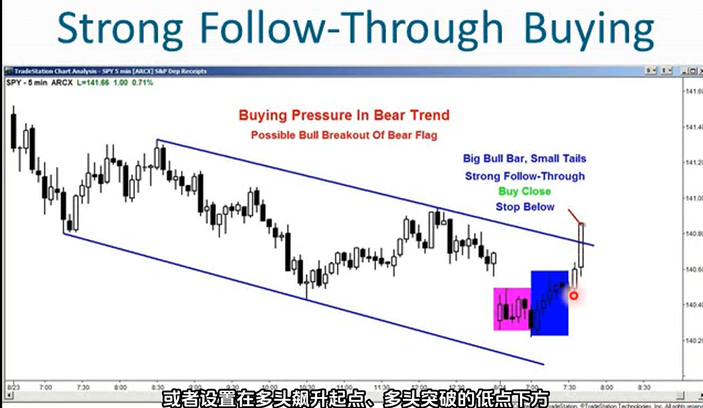
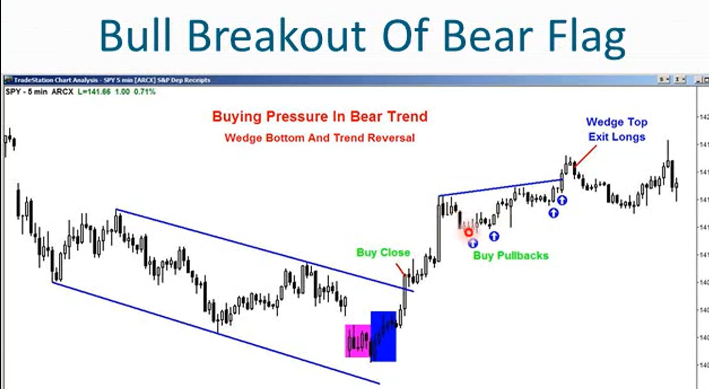

1. 买盘压力：价格行为有利于多头时
2. 买盘压力：价格行为有利于空头时
3. 多头和空头会留下下痕迹，这些痕迹就表明了压力的存在
4. 买入压力的迹象：
    - 基本强度特征
        - 阳线比阴线多
        - 阳线实体大于阴线实体
        - K线下方出现影线（低价拒绝）
    - 趋势加速特征
        - 出现连续的阳线
        - 连续阳线的数量增加
        - 阳线实体逐渐变大
        - K线收盘价接近最高价
    - 极端强势特征
        - 出现陡峭且细的多头微型通道
        - 跳空缺口的突破型阳线且下一根K线继续走强
    - 空头衰退特征
        - 连续阴线的数量减少
        - 阴线实体逐渐减少
5. 在交易区间内多头和空头都在争夺突破，通过观察买盘压力和卖盘压力的大小，判断哪一方更有可能获胜
6. 始终持仓原则：如果你必须要入场进行选择做多还是做空时，始终根据之前的方向选择
7. 当趋势非常强劲时直接入场，或者在一个小幅回调时入场
8. 如果止损位必须设的很远，那就轻仓交易

9. 缺口：连续两根K线，前一根K线的最高价和后一根K线的最低价；前一根K线的最低价和后一根K线的最高价之间的差值，就是缺口。缺口用于描述多空力量
10. 当出现明显多空压力，至少应该建立顺应压力的头寸
11. 通道通常会成为交易区间的第一段走势

12. 当进行上涨突破时买入（图中），止损点通常设置在多头飙升起点，或者多头突破的低点下方
