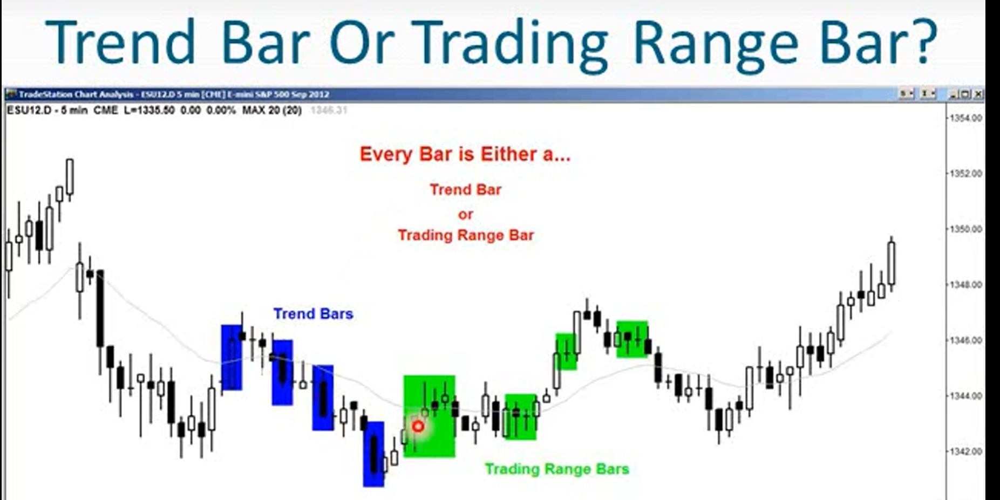
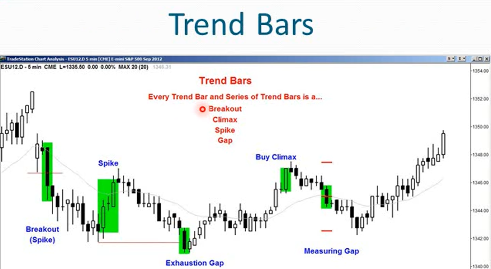

1. 市场要么处于趋势行情要么处于盘整区间。如果不清楚处于什么行情，那么就处于盘整区间
2. 市场具有惯性，总是倾向于做他一直在做的事情
3. 如果市场处于趋势中，80%的反向尝试都会失败
4. 当市场处于交易区间中，80%的突破尝试都会失败
5. 当你不确定是什么行情时，就是处于区间震荡行情
6. 等待回调但回调一直不来时，那就处于趋势行情
7. 如果市场处于趋势行情，那么必须立即或几分钟内入场。因为趋势行情会处于很长时间而不出现回调
8. 如果你必须在这一分钟进入市场，选择的方向就是始终持仓方向
9. 始终持仓方向通常是非常明确的，如果无法根据过去2-4根K线判断，那就回溯20或30根K线，寻找最近的涨跌尖峰
10. 建仓远比错过趋势重要的多
11. 趋势中价格大多朝一个方向移动，某个时刻突破阶段会过度到通道阶段。
12. 通道对于新手来说并不那么明显
13. 新手看到行情认为可能形成了通道，又会否认这可能是一个通道。但这很可能就是一个通道
14. 趋势可能小到只有1根K线，趋势也可能涵盖整个图标
15. 多头趋势的特征：
    - 更高的高点和更高的低点
    - 包含在一个上升通道中
    - 通道的底部为趋势线，通道顶部为趋势通道线
16. 对于多头趋势，只要创造更高的高点和更高的低点，趋势就依旧有效
17. 描述市场走势的术语列表

|术语|术语|定义|
|-|-|-|
|trend|趋势|牛市中的向上走势，熊市中的向下走势，趋势占据屏幕中的大部分区域。任何时候屏幕上的趋势不能超过两个，如果超过了两个，则不始终趋势术语|
|swing|摆动|较小的趋势，图标上至少要有两次摆动，可以存在于一个趋势内，也可以存在一个交易区间内|
|Leg|波段|比摆动swing更小，是趋势或交易区间内的小趋势，回调就是波段的一个例子。|
|PullBack|回调|回调是趋势中的任何停顿，可以停顿20根以内的K线，交易者相信趋势不久后会恢复|
|Trading Range|交易区间|如果回调持续的K线太多且失去了预测价值，就不再是回调而是演变成交易区间。交易区间可以是一根K线，也可以占满整个屏幕，这是一种突破方向不明的回调。交易区间就是没有趋势的情况|
|Spike|尖峰|每根趋势K线或者一系列的趋势K线都是一次突破也被称为尖峰|
|Gap|跳空|每根趋势K线就是一个跳空，趋势开始时的突破跳空，趋势中途的测量跳空，趋势末尾的衰竭跳空|
|Climax|高潮|每根趋势K线也是一个高潮，有时会反转，有时不会|

18. 在强劲的趋势行情中，新手总是在等待回调
    - 追求不切实际的风险控制，希望以较小的止损以损失风险
    - 焦虑回调迟迟不来 
    - 错过巨大趋势：害怕因宽幅止损带来大额亏损
19. 新手的做法和机构并不一致，如果市场持续上涨一根K线接一根K线不断走高，机构会一根K线又一根K线的持续买入，不断的进场盈利。如果你想赚钱就需要模仿机构的操作。
20. 正确的做法，你要买入，小单买入，并将止损位设置的远一些。
21. 如果你看见图标觉得有充分的理由买入，过一分钟再看觉得也有充分的理由卖出，这意味你感到困惑了，这正是盘整区间的标志。
22. 当你同时看到买入和卖出的模式时，市场正在处于交易区间中。需要调整自己的交易手法以适应盘整区间
23. 当市场处于趋势行情时，只进行趋势交易并尝试部分甚至全部持仓波段操作。想要让利润增长，训练自己不要过早离场
24. 当市场处于盘整区间时，要时刻想着和当前趋势反向操作。当市场冲向顶部，不要期待突破，寻找反转
25. 所以交易都要设置保护性止损，无论处于趋势行情还是盘整区间
26. 如果无法判断当前处于盘整区间还是趋势区间，那就假定处于盘整区间，并按照盘整区间的方式交易
27. 每根K线要么时趋势K线要么是盘整K线
    - 趋势K线：实体较大，影线较小
    - 盘整K线：实体较小，影线较大
    - 当不确定时，结合上下文判断
    - 如果K线实体较小，但处于强劲趋势中，更像是趋势K线
    - 如果K线实体较大，但市场呈现横盘状态，有很多重叠的K线，长影线，频繁的反转，那它就是震荡区间K线

28. 应当将每根趋势K线视为一个突破，一个缺口还有一个高潮

29. 交易量大的标的趋势K线对应着交易量小的标的的跳空，这两者可以看作等价的
