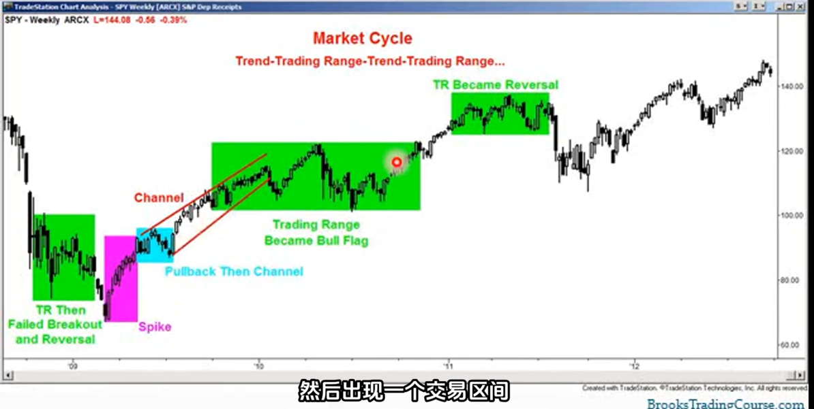
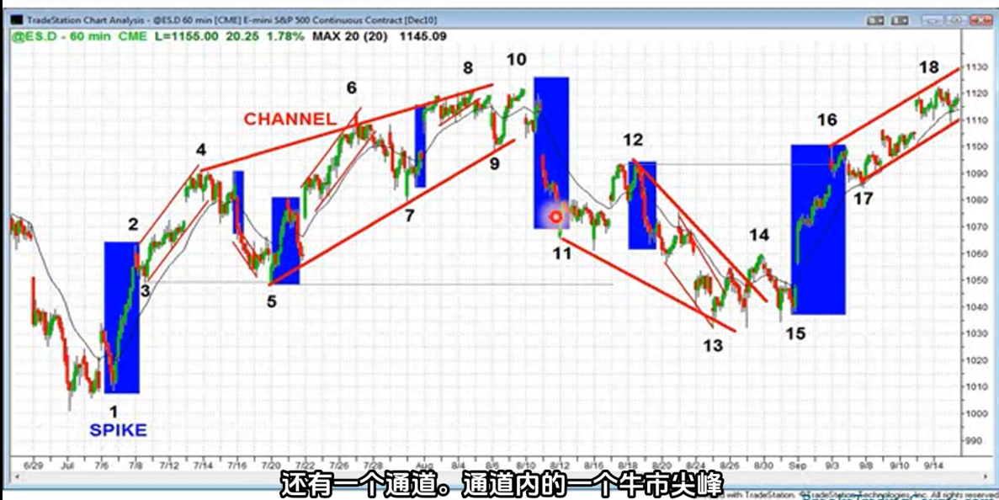

# 市场周期
1. 市场是一个永不停止的周期中，在交易区间和趋势之间交替
2. 当市场处于交易区间时，它可能向任意一个方向突破
3. 进入交易区间之前，交易的趋势并不重要
4. 每个趋势都由突破阶段组成
    - 最开始的大趋势K线或一系列趋势K线
    - 然后是通道阶段（此时市场出现回调，但仍被限制在两条线之间）
    - 通道最终会变得更平缓、更宽阔
    - 通道进而演变成交易区间
    - 交易区间最终会突破
5. 在交易区间内寻找买卖压力的迹象，以了解哪一方更可能获胜
6. 可以将交易区间视为一种趋势的过渡
7. 趋势可能很强劲，比如突破行情，一连串非常大的趋势K线
8. 交易区是可能很小单根K线的回调，也可能大到整个屏幕
9. 当趋势出现回调是是趋势的一部分，你该认为趋势将继续，突破将沿趋势方向继续进行
10. 当交易区间持续较长时，如超过了20根K线，趋势就会失去方向，对市场的影响很弱，此时突破可能会朝任何一发方向发展（趋势延续或反转）
11. 所有的趋势反转形态都和交易区间相关（如头肩顶形态就是交易区间，回调只是一个小的交易区间是趋势中的短暂停顿）
12. 如果回调时间过长失去了方向，你就不知道它会向上突破还是向下突破。此时不能称其为回调，而是称为交易区间
13. 所有回调在较小时间维度的图标上都是交易区间，所有交易区间都是更高时间维度上的回调

14. 交易区间可能会朝着趋势方向突破，也可能朝着相反方向突破。还可能先朝一个方向突破，然后反转，再朝另一个方向发展
15. 事实上，大多数在交易区间中的突破都会失败
16. 市场每时每刻都处于交易区间或者趋势中
17. 交易者首先要确定自己是处于交易区间，还是处于趋势中。
18. 当市场在处于趋势的急升或急跌阶段时，一旦确定，果断加入趋势。
19. 当市场处于盘整区间，但当交易者看到一系列的多头k线，而且突破了k线通道，一旦确定，果断加入趋势
20. 当市场处于盘整区间，交易者需要认为市场将在很长一段时间内上下波动，要求自己最好低买高卖，且最好不要长时间持仓。因为价格会回到买入价位
21. 在盘整区间的最佳方式是超短交易，低买高卖

22. 了解市场周期以及处于当前处于哪个阶段非常重要，周期的每个阶段都有不同的交易机会
23. 交易时要尽量少考虑事情，将所有事情转化为二元决策，尽量给自己只留两个选择。
24. 二元决策举例：牛市趋势是牛市趋势中的一段趋势，还是仅仅是交易区间内的一次反弹？区分这一点很重要，因为这两种反弹的交易方式不同。
    - 在强劲的牛市中，应该只考虑买入，并且至少要持有部分仓位做波段
    - 在交易区间的牛市反弹中，抓住买入机会是明智的。不过如果出现强劲的卖出信号，特别有二次入场的空头机会也可以把我这些机会
25. 在交易区间内，重点应放在超短交易，而非波段交易上
26. 很多情况下，尖峰行情太大了，止损位必须设的很远，是的，就该这样，必须设的很远。所以买入少量仓位并设置较宽的止损位是值得的
27. 如果处于突破阶段或者叫做尖峰行情，需要立即做多。牛市趋势，至少应该在市场上买入少量仓位
28. 当上升趋势减弱并进入通道阶段时
    - 如果是窄通道，从本质上说这是更高时间框架图表上的一次尖峰行情，应该向对待突破行情一样交易。
    - 如果是宽通道，那么就需要加强注意力了，注意买入信号。如果上下波动幅度非常大，尤其是整体趋势没有那么陡峭或仅略微上升时，应该像对待交易通道一样交易，进行超短线交易（BLSHS）低买高卖、剥头皮交易
29. 如果市场下跌
    - 要么是熊市趋势，要么是交易区间内的一段跌势。如果是单边趋势，只考虑做空，至少持有部分空头头寸进行波段交易。
    - 如果处于交易区间内的下跌波段，接受卖出信号，接受强势的买入信号及二次进场做多信号，剥头皮交易
30. 如果市场处于强劲的做空趋势，看作突破阶段，下跌尖峰。立即建立少量空投头寸，如果1-2分钟内无法确定如何做空，至少以市场价卖出一小部分仓位。将止损位设置在单边急涨的顶部，大多数情况下这是一个非常宽的止损位，需要轻仓。随着趋势发展，寻找更多入场机会
31. 止损位较宽时，需要轻仓
